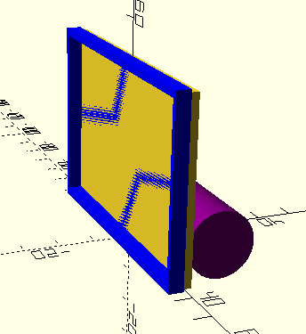

# Подсветка для рамки кадров ренгеноскопии

## Frame Backlight

Model for 3D-printing on language OpenScad
Backlight powered from akkum 18650 LiIon.

#Hyperlinks

1. [OpenScad model holder for akkum 18650] (https://www.thingiverse.com/thing:456900/files) on site thingiverse.